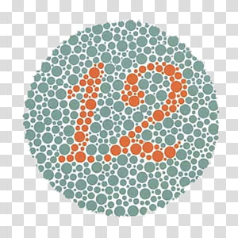
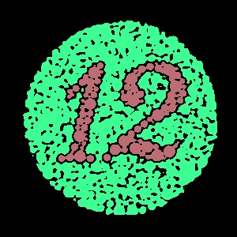
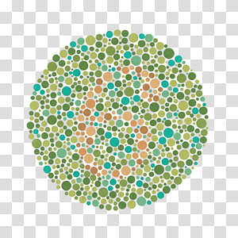
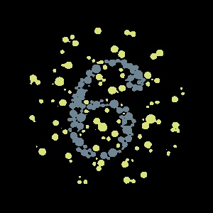

# KMeans Image Segmentation

This project implements a custom KMeans clustering algorithm for image segmentation using color features. It supports multiple color spaces (HSV, Lab, YCbCr).

## Sample Results

Original vs. Segmented:

| Original Image | Segmented Output |
|----------------|------------------|
|  |  |
|    |    |

## Project Structure

```
├── README.md
└── src
├── main.py        # Entry point for running the segmentation
├── kmeans.py      # KMeans clustering class
└── imgs/          # Images Directory 
````

## Usage
Make sure you have OpenCV and NumPy installed:

```bash
pip install opencv-python numpy
````

Run the main script:
```bash
python src/main.py
```
